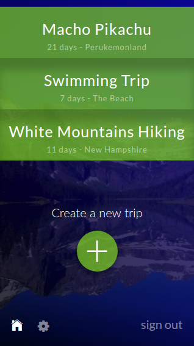
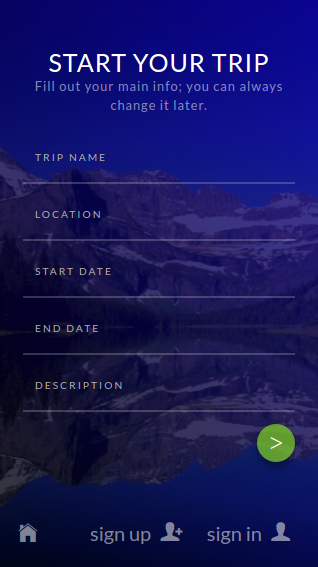
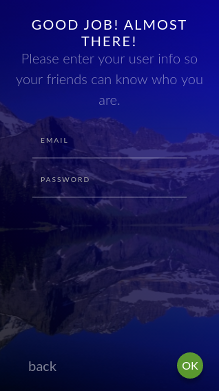
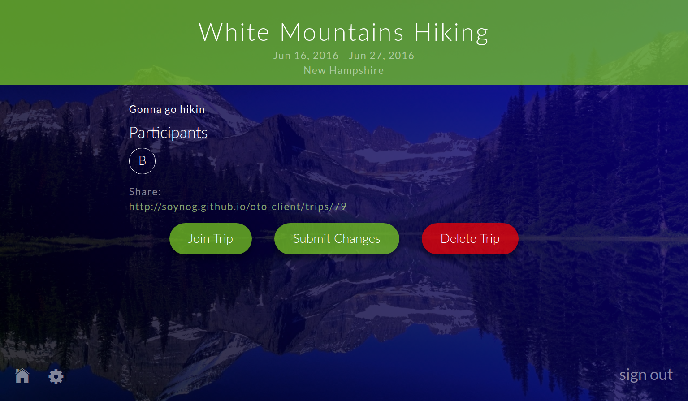

# OTO - Outdoor Trip Organizer #
## Front End Client ##

OTO, the Outdoor Trip Organizer, makes organizing a camping trip with your friends easy! Or at least it will, once we build in more functionality. Stay tuned for meal planning, gear lists, rides coordination, and other features.

### Screenshots ###

### Technologies ###

OTO is built using the Ember.js front-end framework, which allows for streamlined and effective data management and transition between viewstates. Styling is built using the lightweight Bourbon/Neat/Bitters styling library. The OTO back-end API was created using Ruby on Rails.

### Development Approach ###

This project was undertaken in close collaboration with Norman Wozniak, a student in General Assembly's User Experience Design Immersive course at the time that I was taking GA's Web Development Immersive. Norman and I both thought we would benefit greatly from the experience of working with someone from the other side of the design process, and the schedule of our respective projects worked out perfectly.

Once we'd decided on the concept, Norman surveyed and interviewed potential users to determine what their primary needs are. Using the results, we identified high-priority features by importance to users and feasibility of implementation. Then Norman created a clickable prototype using Invision, which provided a model for me to work towards in my development process, as well as some CSS snippets for color scheme, element styling, etc.

Here is a screenshot of our design process: https://drive.google.com/file/d/0B3FcEJsly5g6WGtaRmRKTm04ZzA/view?usp=sharing

### Installation Instructions ###

1. npm install
2. bower install
3. ember install ember-moment

### User Stories and Pitch Deck ###

User stories and personas created as part of Norman's design process are available here: https://docs.google.com/spreadsheets/d/1g6vOqxNPHpIHsRZa0-lN4C7wBbNRdCJpix2URCyJHRc/edit?usp=sharing

Screenshots of Database Design Schema:
https://drive.google.com/file/d/1Xi47DjDYr-lRpWaDnwOIuwjz-GFb8czdSw/view?usp=sharing
https://drive.google.com/file/d/1C10l8MTmCRuqIxQd1OAzHR_Aa8Ovo9SeCg/view?usp=sharing

Clickable Prototype/Wireframe:
https://projects.invisionapp.com/share/PW7H84HV5#/screens/162819781

### Moving Forward ###

OTO is decidedly a work in progress. So far we've successfully built a working framework with baseline functionality--but before this app lives up to its potential we will need to add significantly more functionality. The highest priority needs are meal planning, gear lists, chat, and ride coordination cards.

Challenges on my end included the difficulty of learning my first front-end framework, Ember.js. Although I believe Ember was definitely the right choice for this project and will make things significantly easier moving forward, it slowed some things down in the near-term. In particular, working with complex data relationships in Ember is quite tricky, as I discovered.

I look forward to working with Norman this summer to continue building out this app, hopefully to the point that we can use it to organize trips with our friends!

### Links ###
Deployed OTO on gh-pages: http://soynog.github.io/oto-client/
API Back-End Repo: https://github.com/soynog/oto-api
Deployed API: https://oto-api.herokuapp.com/
